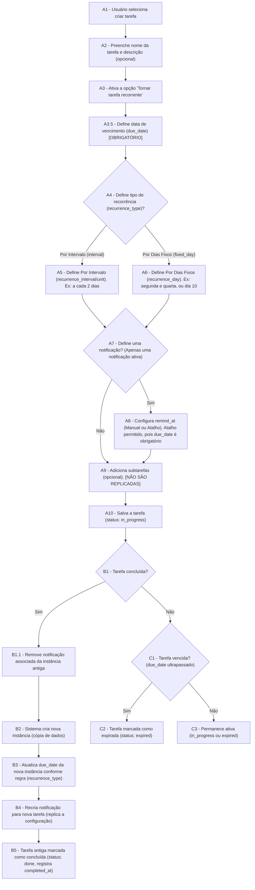

# Fluxo de criação de tarefas recorrentes

```mermaid
flowchart TD
  %% Criação
  A1["A1 - Usuário seleciona criar tarefa "]
  A2["A2 - Preenche nome da tarefa e descrição (opcional)"]
  A3["A3 - Ativa a opção 'Tornar tarefa recorrente'"]
  A3_5["A3.5 - Define data de vencimento (due_date) [OBRIGATÓRIO]"]
  A4{"A4 - Define tipo de recorrência (recurrence_type)?"}
  A5["A5 - Define Por Intervalo (recurrence_interval/unit). Ex: a cada 2 dias "]
  A6["A6 - Define Por Dias Fixos (recurrence_day). Ex: segunda e quarta, ou dia 10 "]
  A7{"A7 - Define uma notificação? (Apenas uma notificação ativa) "}
  A8["A8 - Configura remind_at (Manual ou Atalho). Atalho permitido, pois due_date é obrigatório "]
  A9["A9 - Adiciona subtarefas (opcional). [NÃO SÃO REPLICADAS]"]
  A10["A10 - Salva a tarefa (status: in_progress)"]

  %% Execução (Automação da Recorrência)
  B1{"B1 - Tarefa concluída?"}
  B1_1["B1.1 - Remove notificação associada da instância antiga"]
  B2["B2 - Sistema cria nova instância (cópia de dados)"]
  B3["B3 - Atualiza due_date da nova instância conforme regra (recurrence_type)"]
  B4["B4 - Recria notificação para nova tarefa (replica a configuração)"]
  B5["B5 - Tarefa antiga marcada como concluída (status: done, registra completed_at)"]

  %% Expiração
  C1{"C1 - Tarefa vencida? (due_date ultrapassado)"}
  C2["C2 - Tarefa marcada como expirada (status: expired)"]
  C3["C3 - Permanece ativa (in_progress ou expired)"]

  %% Ligações
  A1 --> A2
  A2 --> A3
  A3 --> A3_5
  A3_5 --> A4

  A4 -- "Por Intervalo (interval)" --> A5
  A4 -- "Por Dias Fixos (fixed_day)" --> A6

  A5 --> A7
  A6 --> A7

  A7 -- "Sim" --> A8
  A7 -- "Não" --> A9

  A8 --> A9
  A9 --> A10

  %% Pós-criação
  A10 --> B1

  B1 -- "Sim" --> B1_1
  B1_1 --> B2
  B2 --> B3
  B3 --> B4
  B4 --> B5

  B1 -- "Não" --> C1
  C1 -- "Sim" --> C2
  C1 -- "Não" --> C3
```