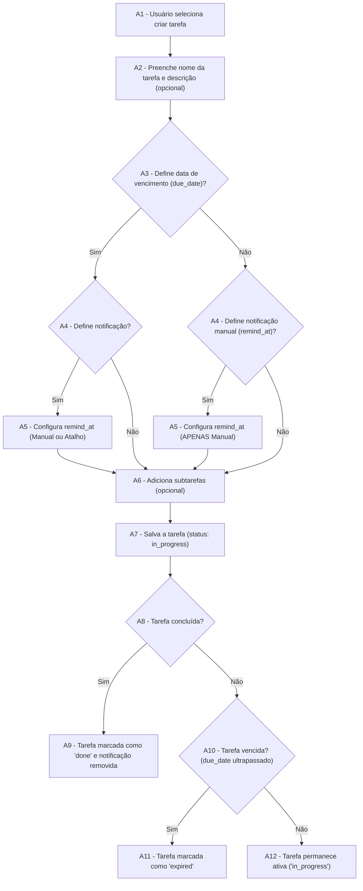

# Fluxo de criação de tarefas simples

```mermaid
flowchart TD
  %% Etapas iniciais
  A1["A1 - Usuário seleciona criar tarefa"]
  A2["A2 - Preenche nome da tarefa e descrição (opcional)"]
  A3{"A3 - Define data de vencimento (due_date)?"}

  %% Ramificação com Vencimento (Permite Atalhos)
  A3 -- "Sim" --> A4_Sim{"A4 - Define notificação?"}
  A4_Sim -- "Sim" --> A5_Sim["A5 - Configura remind_at (Manual ou Atalho)"]
  A4_Sim -- "Não" --> A6

  %% Ramificação sem Vencimento (Apenas Manual)
  A3 -- "Não" --> A4_Nao{"A4 - Define notificação manual (remind_at)?"}
  A4_Nao -- "Sim" --> A5_Nao["A5 - Configura remind_at (APENAS Manual)"]
  A4_Nao -- "Não" --> A6

  %% Pós-Configuração
  A5_Sim --> A6
  A5_Nao --> A6

  A6["A6 - Adiciona subtarefas (opcional)"]
  A7["A7 - Salva a tarefa (status: in_progress)"]

  %% Conexões principais Pós-Criação
  A1 --> A2
  A2 --> A3
  A6 --> A7

  %% Pós-criação: acompanhamento
  A7 --> A8
  A8{"A8 - Tarefa concluída?"}
  A8 -- "Sim" --> A9
  A8 -- "Não" --> A10

  A9["A9 - Tarefa marcada como 'done' e notificação removida"]

  A10{"A10 - Tarefa vencida? (due_date ultrapassado)"}
  A10 -- "Sim" --> A11
  A10 -- "Não" --> A12

  A11["A11 - Tarefa marcada como 'expired'"]
  A12["A12 - Tarefa permanece ativa ('in_progress')"]
```

